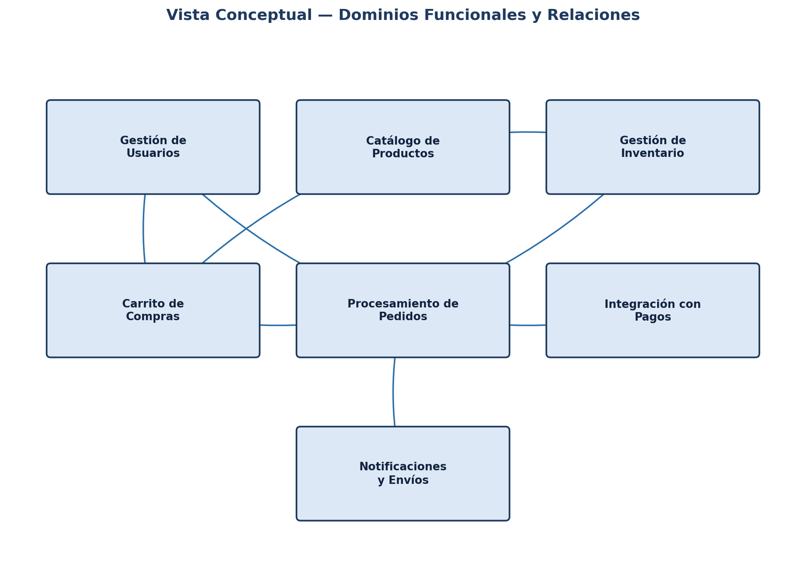
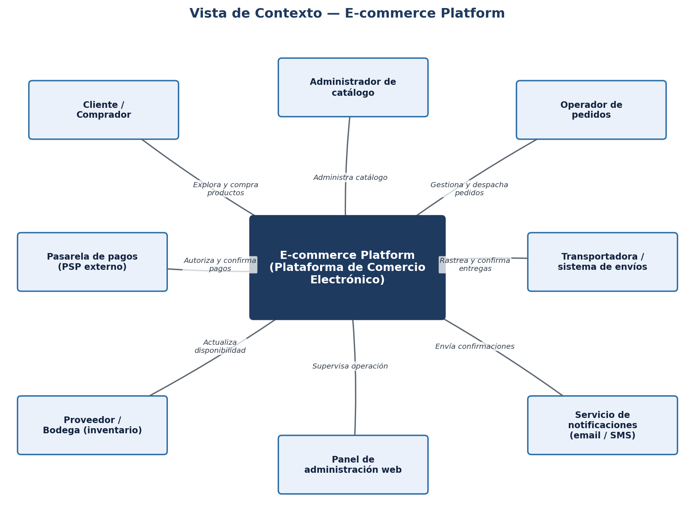
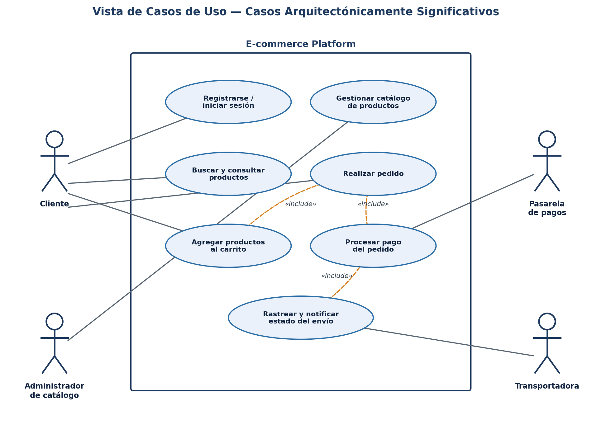
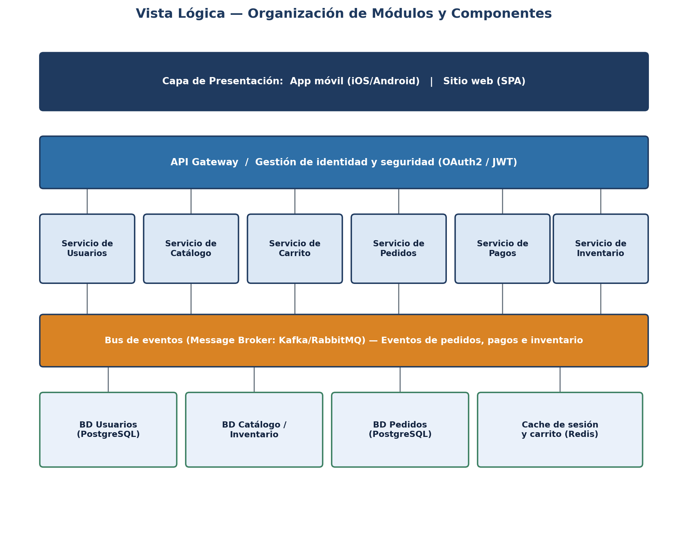
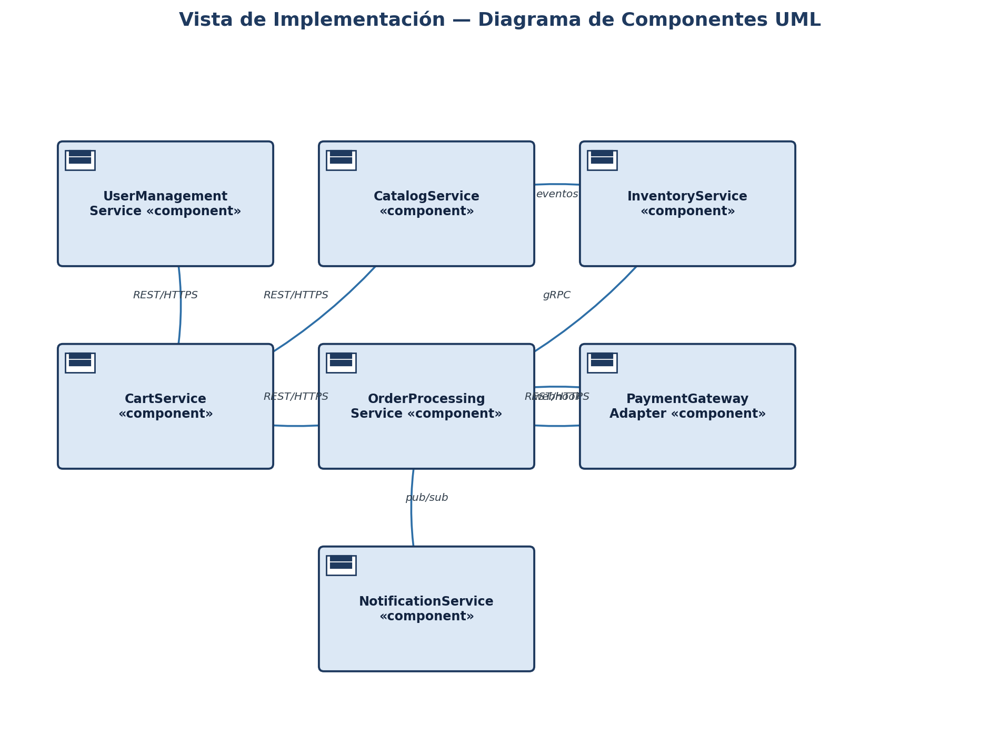
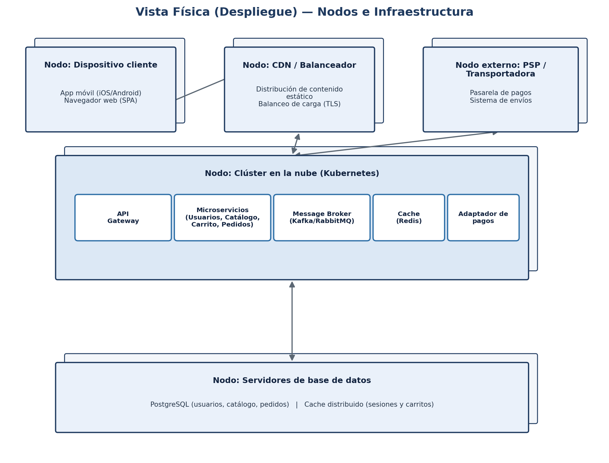

# Documento de Especificación Arquitectónica de Software (SAD)

## Plataforma de Comercio Electrónico (E-commerce Platform)

Elaborado siguiendo los lineamientos del **Rational Unified Process (RUP)** y el **Modelo de Vistas 4+1 de Kruchten**.

**Equipo de trabajo:** Miguel Andrés Alzate Ramírez
**Asignatura:** Arquitectura de Software
**Fecha:** Agosto de 2026

---

## Tabla de contenido

1. [Introducción](#1-introducción)
2. [Documento de visión](#2-documento-de-visión)
3. [Especificación de requisitos](#3-especificación-de-requisitos)
4. [Modelo conceptual del dominio y decisiones arquitectónicas](#4-modelo-conceptual-del-dominio-y-decisiones-arquitectónicas)
5. [Vistas arquitectónicas (modelo 4+1 de Kruchten)](#5-vistas-arquitectónicas-modelo-41-de-kruchten)
6. [Coherencia entre requisitos, decisiones y vistas](#6-coherencia-entre-requisitos-decisiones-y-vistas)
7. [Conclusiones](#7-conclusiones)
8. [Referencias bibliográficas](#8-referencias-bibliográficas)

---

## 1. Introducción

El presente documento contiene la Especificación Arquitectónica de Software (Software Architecture Document — SAD) de la **E-commerce Platform**, una plataforma de comercio electrónico orientada a permitir a los usuarios explorar catálogos de productos, gestionar carritos de compra, procesar pedidos y realizar pagos en línea de forma segura y escalable.

El documento se elaboró siguiendo los lineamientos del Rational Unified Process (RUP) y organiza la arquitectura del sistema mediante el modelo de vistas 4+1 propuesto por Philippe Kruchten, el cual permite describir la arquitectura desde distintas perspectivas complementarias: contexto, dominio conceptual, casos de uso, lógica, implementación y despliegue físico. Esta separación de vistas facilita la comunicación con los distintos interesados del proyecto y garantiza la trazabilidad entre los requisitos, las decisiones arquitectónicas y los artefactos de diseño.

El caso de estudio seleccionado corresponde a la **Opción 1: Plataforma de comercio electrónico**, cuyas capacidades funcionales centrales son la gestión de usuarios, el catálogo de productos, el carrito de compras, el procesamiento de pedidos y la integración con pasarelas de pago.

---

## 2. Documento de visión

### 2.1 Descripción del problema

Los negocios que desean comercializar sus productos en línea requieren una plataforma capaz de gestionar de forma confiable el ciclo completo de una compra: desde la exploración del catálogo hasta la confirmación del pago y el envío. Las soluciones desarrolladas de forma monolítica o poco escalable presentan dificultades para soportar picos de demanda, para integrarse con múltiples pasarelas de pago y proveedores logísticos, y para evolucionar de manera independiente cada capacidad del negocio sin afectar a las demás.

La E-commerce Platform busca resolver esta problemática mediante una arquitectura que permita gestionar el catálogo de productos, el carrito de compras, el procesamiento de pedidos, la integración con pagos y la gestión de usuarios de forma desacoplada, segura y escalable.

### 2.2 Objetivos del sistema

- Gestionar el registro, autenticación y perfil de los usuarios de la plataforma.
- Administrar un catálogo de productos con información actualizada de precios y disponibilidad.
- Permitir a los usuarios agregar, modificar y eliminar productos de su carrito de compras.
- Procesar los pedidos generados a partir del carrito, gestionando su ciclo de vida completo.
- Integrarse con pasarelas de pago externas para autorizar y confirmar transacciones de forma segura.
- Gestionar el inventario disponible y coordinar la notificación y el seguimiento de los envíos.

### 2.3 Alcance

El sistema cubrirá el registro y autenticación de usuarios, la administración del catálogo de productos, la gestión del carrito de compras, el procesamiento de pedidos, la integración con pasarelas de pago externas, el control de inventario y el envío de notificaciones al cliente sobre el estado de su pedido. Quedan fuera del alcance de esta primera versión la gestión de devoluciones y reembolsos avanzados, los programas de fidelización y el marketplace multivendedor.

### 2.4 Stakeholders

| Stakeholder                | Rol / interés en el sistema                                                                         |
| -------------------------- | --------------------------------------------------------------------------------------------------- |
| Cliente / comprador        | Usuario final que explora el catálogo, realiza pedidos y efectúa pagos desde la app o el sitio web. |
| Administrador de catálogo  | Gestiona la información de productos, precios y disponibilidad.                                     |
| Operador de pedidos        | Supervisa y gestiona el ciclo de vida de los pedidos y coordina su despacho.                        |
| Pasarela de pagos (PSP)    | Entidad externa que autoriza y confirma las transacciones de pago.                                  |
| Transportadora / logística | Entidad externa encargada del despacho y entrega de los pedidos.                                    |
| Administrador del sistema  | Gestiona usuarios, permisos, integraciones y disponibilidad de la plataforma.                       |
| Equipo de desarrollo       | Diseña, construye y mantiene la plataforma de software.                                             |

### 2.5 Módulos funcionales identificados

- Módulo de Gestión de Usuarios.
- Módulo de Catálogo de Productos.
- Módulo de Carrito de Compras.
- Módulo de Procesamiento de Pedidos.
- Módulo de Integración con Pagos.
- Módulo de Gestión de Inventario.
- Módulo de Notificaciones y Envíos.

---

## 3. Especificación de requisitos

### 3.1 Requisitos funcionales por módulo

| ID    | Módulo                   | Requisito funcional                                                                                        |
| ----- | ------------------------ | ---------------------------------------------------------------------------------------------------------- |
| RF-01 | Gestión de usuarios      | El sistema debe permitir el registro y autenticación de clientes mediante correo electrónico y contraseña. |
| RF-02 | Gestión de usuarios      | El sistema debe permitir a los usuarios gestionar su perfil y direcciones de envío.                        |
| RF-03 | Catálogo de productos    | El sistema debe permitir buscar y consultar productos por categoría, nombre o filtros de precio.           |
| RF-04 | Catálogo de productos    | El administrador debe poder crear, actualizar y desactivar productos del catálogo.                         |
| RF-05 | Carrito de compras       | El sistema debe permitir agregar, modificar la cantidad y eliminar productos del carrito.                  |
| RF-06 | Carrito de compras       | El sistema debe conservar el carrito del usuario entre sesiones.                                           |
| RF-07 | Procesamiento de pedidos | El sistema debe generar un pedido a partir del contenido del carrito y calcular el total a pagar.          |
| RF-08 | Procesamiento de pedidos | El sistema debe permitir consultar el estado y el historial de los pedidos realizados.                     |
| RF-09 | Integración con pagos    | El sistema debe integrarse con una o más pasarelas de pago externas para autorizar transacciones.          |
| RF-10 | Integración con pagos    | El sistema debe confirmar o rechazar un pedido según la respuesta de la pasarela de pago.                  |
| RF-11 | Gestión de inventario    | El sistema debe reservar y descontar el stock disponible al confirmarse un pedido.                         |
| RF-12 | Notificaciones y envíos  | El sistema debe notificar al cliente el estado de su pedido (confirmado, en camino, entregado).            |

### 3.2 Requisitos no funcionales (atributos de calidad)

| Atributo          | Requisito no funcional                                                                                                                                                                      |
| ----------------- | ------------------------------------------------------------------------------------------------------------------------------------------------------------------------------------------- |
| Rendimiento       | El sistema debe procesar la confirmación de un pedido y su pago en un tiempo no mayor a 3 segundos en condiciones normales.                                                                 |
| Escalabilidad     | El sistema debe soportar picos de tráfico (p. ej. temporadas de descuentos) mediante una arquitectura horizontalmente escalable.                                                            |
| Disponibilidad    | El sistema debe garantizar una disponibilidad mínima del 99.5% para los servicios de catálogo, carrito y pedidos.                                                                           |
| Consistencia      | El sistema debe garantizar que el stock reservado y el estado del pedido permanezcan consistentes ante fallos parciales.                                                                    |
| Seguridad         | El sistema debe proteger los datos de usuarios y transacciones mediante autenticación, autorización y cifrado de las comunicaciones (TLS), y no debe almacenar datos sensibles de tarjetas. |
| Interoperabilidad | El sistema debe integrarse con pasarelas de pago y transportadoras externas mediante APIs estándar (REST/JSON) y notificaciones webhook.                                                    |
| Usabilidad        | La aplicación móvil y el sitio web deben ofrecer un proceso de compra claro, con la menor cantidad de pasos posible.                                                                        |
| Mantenibilidad    | El sistema debe organizarse en componentes desacoplados que permitan evolucionar o reemplazar módulos sin afectar el resto de la plataforma.                                                |

### 3.3 Restricciones técnicas y organizacionales

- El sistema debe integrarse con pasarelas de pago externas que exponen APIs REST y mecanismos de notificación por webhook.
- El desarrollo debe realizarse de forma colaborativa por todos los integrantes del equipo, versionado en este repositorio Git.
- El sistema no debe almacenar directamente datos sensibles de tarjetas de pago, delegando dicho procesamiento a la pasarela de pagos (cumplimiento tipo PCI-DSS).
- La infraestructura debe soportar despliegue en la nube bajo un modelo de contenedores orquestados.
- El presupuesto y el cronograma del proyecto están limitados por los tiempos académicos establecidos para el curso.

---

## 4. Modelo conceptual del dominio y decisiones arquitectónicas

### 4.1 Entidades principales del dominio

- **Usuario**: representa a clientes, administradores de catálogo y operadores de pedidos.
- **Producto**: artículo comercializado en la plataforma, con precio, descripción y stock disponible.
- **Categoría**: agrupación temática de productos dentro del catálogo.
- **Carrito**: conjunto de productos y cantidades seleccionados por un usuario antes de generar un pedido.
- **Pedido**: solicitud de compra generada a partir de un carrito, con un estado y un valor total.
- **Pago**: transacción asociada a un pedido, procesada a través de una pasarela externa.
- **Inventario**: registro de la disponibilidad de stock de cada producto.
- **Envío**: proceso logístico asociado a la entrega de un pedido confirmado.

### 4.2 Relaciones entre entidades

Un Producto pertenece a una o varias Categorías y su disponibilidad se controla mediante el Inventario. Un Usuario posee un Carrito, el cual contiene una o varias líneas de Producto con su respectiva cantidad. Al confirmar la compra, el Carrito da origen a un Pedido, el cual reserva el stock correspondiente en el Inventario y genera una solicitud de Pago hacia la pasarela externa. Una vez confirmado el Pago, el Pedido cambia de estado y genera un Envío, cuyo seguimiento es comunicado al Usuario mediante notificaciones.

### 4.3 Diagrama del modelo conceptual

_Figura 1. Vista conceptual — dominios funcionales y relaciones._

### 4.4 Selección del estilo arquitectónico

Se selecciona una arquitectura basada en **microservicios** combinada con un estilo **dirigido por eventos** (event-driven architecture) para los flujos transaccionales críticos. Esta combinación se justifica porque el sistema requiere independencia y escalado diferenciado entre capacidades con patrones de carga muy distintos —el catálogo se consulta con alta frecuencia de lectura, mientras que el procesamiento de pedidos y pagos exige consistencia transaccional—, lo cual es propio de una arquitectura de microservicios con límites de contexto (bounded contexts) bien definidos.

El uso de un bus de eventos (message broker) para comunicar los servicios de pedidos, inventario y notificaciones permite desacoplar la confirmación de un pedido de las acciones que esta desencadena (reserva de stock, envío de notificación, actualización de disponibilidad en el catálogo), habilitando el procesamiento asíncrono y resiliente que exige el atributo de calidad de consistencia. Por su parte, la separación en microservicios independientes favorece la escalabilidad selectiva y la mantenibilidad del sistema en el tiempo.

### 4.5 Otras decisiones arquitectónicas

- Se adopta un **API Gateway** como punto único de entrada para las aplicaciones cliente, centralizando autenticación y enrutamiento.
- La integración con pasarelas de pago se aísla en un componente adaptador (**PaymentGatewayAdapter**), facilitando el reemplazo o la incorporación de nuevos proveedores de pago.
- Se utiliza una base de datos relacional para información transaccional (usuarios, catálogo, pedidos) y un cache distribuido para las sesiones y el carrito de compras.
- La comunicación entre microservicios se realiza mediante REST/HTTPS para operaciones síncronas y mediante el bus de eventos para los flujos asíncronos de pedidos, inventario y notificaciones.
- El despliegue se realiza sobre contenedores orquestados, lo que facilita la escalabilidad horizontal y la resiliencia ante fallos, especialmente en temporadas de alta demanda.

---

## 5. Vistas arquitectónicas (modelo 4+1 de Kruchten)

### 5.1 Vista de contexto

La vista de contexto delimita las fronteras del sistema, identificando los actores externos y los sistemas con los que interactúa la E-commerce Platform.

_Figura 2. Vista de contexto del sistema._

El sistema interactúa con clientes a través de la aplicación móvil o el sitio web, con administradores de catálogo y operadores de pedidos mediante un panel de administración web, con pasarelas de pago externas para la autorización de transacciones, con proveedores y bodegas para la actualización del inventario, y con transportadoras para el seguimiento de los envíos.

### 5.2 Vista conceptual

La vista conceptual identifica los principales dominios funcionales del sistema y la relación entre ellos.

_Figura 3. Vista conceptual — dominios funcionales._

### 5.3 Vista de casos de uso

La vista de casos de uso representa los casos arquitectónicamente significativos del sistema, junto con los actores que participan en ellos.

_Figura 4. Vista de casos de uso arquitectónicamente significativos._

| Caso de uso                           | Actor(es)                  | Descripción                                                            |
| ------------------------------------- | -------------------------- | ---------------------------------------------------------------------- |
| Registrarse / iniciar sesión          | Cliente                    | El usuario crea una cuenta o inicia sesión en la plataforma.           |
| Buscar y consultar productos          | Cliente                    | El usuario explora el catálogo y consulta el detalle de los productos. |
| Agregar productos al carrito          | Cliente                    | El usuario selecciona productos y cantidades para su compra.           |
| Gestionar catálogo de productos       | Administrador de catálogo  | El administrador crea, actualiza o desactiva productos.                |
| Realizar pedido                       | Cliente                    | El sistema genera un pedido a partir del carrito del usuario.          |
| Procesar pago del pedido              | Cliente, Pasarela de pagos | El sistema solicita la autorización del pago a la pasarela externa.    |
| Rastrear y notificar estado del envío | Cliente, Transportadora    | El sistema informa al cliente el estado de la entrega de su pedido.    |

### 5.4 Vista lógica

La vista lógica describe la organización de los módulos y componentes del sistema en capas, así como las relaciones de dependencia entre ellos.

_Figura 5. Vista lógica — capas y componentes del sistema._

El sistema se organiza en cuatro capas principales: la capa de presentación (aplicación móvil y sitio web), la capa de acceso mediada por un API Gateway que centraliza la seguridad, la capa de servicios de negocio (usuarios, catálogo, carrito, pedidos, pagos e inventario) y la capa de persistencia, que combina bases de datos relacionales con un cache distribuido. Un bus de eventos conecta transversalmente los servicios de pedidos, pagos e inventario.

### 5.5 Vista de implementación

La vista de implementación presenta el diagrama de componentes UML del sistema.

_Figura 6. Vista de implementación — diagrama de componentes UML._

Cada componente expone interfaces bien definidas: el `CartService` se comunica con el `CatalogService` y el `UserManagementService` mediante REST/HTTPS, y con el `OrderProcessingService` para generar el pedido; el `OrderProcessingService` coordina de forma síncrona con el `InventoryService` mediante gRPC para reservar stock, invoca al `PaymentGatewayAdapter` para autorizar el pago, y publica eventos de forma asíncrona hacia el `NotificationService`.

### 5.6 Vista física (despliegue)

La vista física describe los nodos de infraestructura sobre los cuales se despliegan los componentes del sistema.

_Figura 7. Vista física — nodos e infraestructura de despliegue._

- **Nodo de dispositivo cliente**: app móvil y sitio web (SPA).
- **Nodo de CDN / balanceador**: distribuye contenido estático y balancea la carga con terminación TLS.
- **Nodo externo (PSP / transportadora)**: sistemas externos de pago y logística.
- **Nodo de clúster en la nube (Kubernetes)**: API Gateway, microservicios, message broker, cache y adaptador de pagos.
- **Nodo de servidores de base de datos**: bases relacionales y cache distribuido de sesiones y carritos.

La estrategia de despliegue seleccionada es de tipo **cloud-native**, mediante contenedores orquestados con Kubernetes e integración/despliegue continuo (CI/CD), con autoescalado horizontal de los microservicios de catálogo y carrito.

---

## 6. Coherencia entre requisitos, decisiones y vistas

La arquitectura propuesta mantiene trazabilidad entre los requisitos definidos y las vistas presentadas. El requisito de escalabilidad ante picos de demanda se atiende mediante la organización en microservicios desplegados sobre un clúster orquestado con autoescalado, visible en la vista física. El requisito de consistencia entre el pedido, el pago y el inventario (RF-07, RF-10, RF-11) se soporta mediante la coordinación síncrona del `OrderProcessingService` con el `InventoryService` y el `PaymentGatewayAdapter`, y mediante el bus de eventos para las acciones derivadas, representados en las vistas lógica y de implementación. La integración con pagos (RF-09, RF-10) se refleja en el componente `PaymentGatewayAdapter`, que aísla la comunicación con proveedores externos. Finalmente, el atributo de seguridad se atiende mediante el API Gateway centralizado y la decisión de no almacenar datos sensibles de tarjetas.

---

## 7. Conclusiones

- La aplicación del modelo 4+1 de Kruchten permitió representar la arquitectura de la E-commerce Platform desde perspectivas complementarias, facilitando la comprensión del sistema por parte de los distintos interesados.
- La combinación de una arquitectura de microservicios con un estilo dirigido por eventos resulta adecuada para plataformas de comercio electrónico que deben equilibrar alta disponibilidad de lectura en el catálogo con consistencia transaccional en pedidos y pagos.
- El aislamiento de la integración con pasarelas de pago en un componente adaptador dedicado facilita la incorporación de nuevos proveedores y el cumplimiento de requisitos de seguridad.
- La trazabilidad entre requisitos, decisiones arquitectónicas y vistas evidencia la coherencia interna de la propuesta.

---

## 8. Referencias bibliográficas

- Kruchten, P. (1995). Architectural Blueprints — The "4+1" View Model of Software Architecture. _IEEE Software_, 12(6), 42-50.
- Bass, L., Clements, P., & Kazman, R. (2012). _Software Architecture in Practice_ (3rd ed.). Addison-Wesley.
- Object Management Group. (2017). _Unified Modeling Language (UML) Specification_, Version 2.5.1. OMG.
- Rational Software / IBM. (2003). _Rational Unified Process: Best Practices for Software Development Teams_.
- Newman, S. (2021). _Building Microservices: Designing Fine-Grained Systems_ (2nd ed.). O'Reilly Media.
- Richardson, C. (2018). _Microservices Patterns: With Examples in Java_. Manning Publications.
